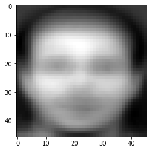
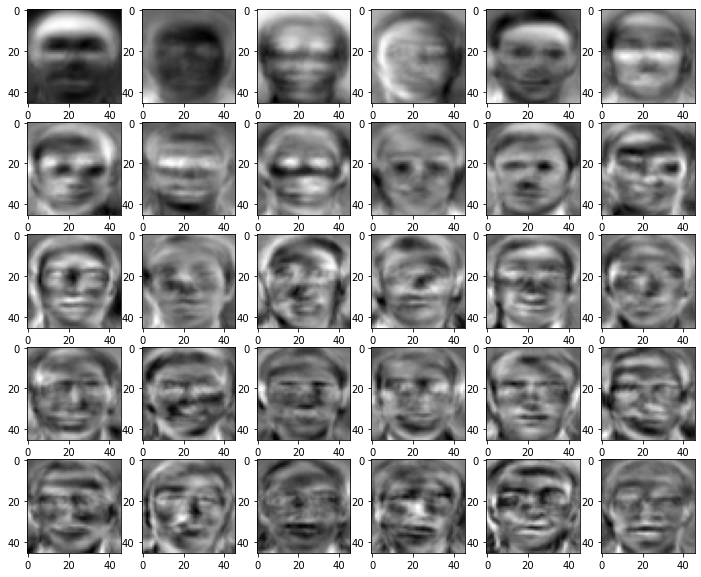
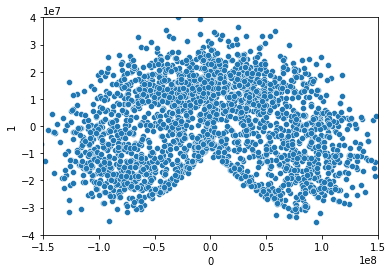
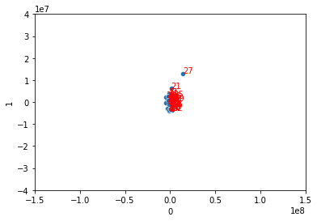
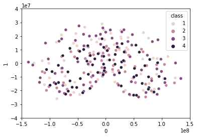
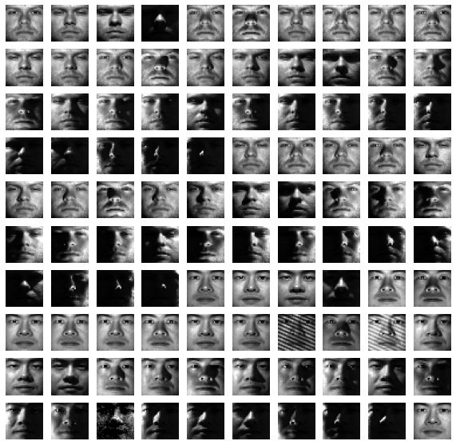

# 基于 PCA 实现人脸识别
## 概述
PCA 能够利用正交变换对一系列可能相关的变量进行线性变换，将其投影为一系列线性不相关的主成分变量。如果我们将一系列面部图像看作变量，若面部图像间存在相关关系，通过 PCA 我们就可以将面部图像投影为一系列不相关的主成分图像——即特征脸（Eigenface），相应的空间则称为面部空间（face space）。

为了实现人脸识别，即对人脸进行分类，我们需要将每个人的多幅已知面部图像投影到面部空间，得到相应的多组坐标——即模式向量（pattern vector），并取均值。当有待识别的面部图像时，我们首先计算待识别图像的模式向量，然后计算其与每个已知人脸的模式向量的距离，并取最近的已知人脸作为识别结果。

## 具体算法

假设有 $M$ 幅已知面部图像 $\mathbf\Gamma_1,\mathbf\Gamma_2,\cdots,\mathbf\Gamma_M$. 对其进行中心化：
$$\mathbf\Phi_i=\mathbf\Gamma_i-\bar{\mathbf\Gamma}$$
将 $\Phi$ 分解为 $M$ 个特征向量 $\mathbf u_1,\cdots,\mathbf u_m$ 和相应的特征值 $\lambda_1,\cdots,\lambda_M$：
$$\mathbf\lambda_k = {1\over M} \sum_{n=1}^M (\mathbf u^T_k \Phi_n)$$
并使得每次的 $\lambda_k$ 最大。

模式向量 $\mathbf \Omega=[w_1,w_2,\cdots,w_M]^T$，其中
$$w_k=\mathbf u^T_k (\mathbf\Gamma - \bar{\mathbf \Gamma})$$
待分类面部图像与第 $k$ 类面部图像类的距离为
$$\epsilon_k = ||\Omega - \Omega_k||^2$$
其中 $\mathbf\Omega$ 为待分类图像的模式向量， $\mathbf\Omega_k$ 为第 $k$ 类面部图像类的模式向量的均值。

分类结果即为
$$\arg_k\min\epsilon_k$$

## 程序实现
使用 Python 实现上述算法，并使用 Olivetti Research Laboratory 面部数据集进行测试：
```python
import numpy as np
import scipy.io
import sklearn as sk
from sklearn import *

# 载入 Olivetti Research Laboratory 面部数据集
mat = scipy.io.loadmat('ORL4646.mat')
fea = np.array([mat['ORL4646'][:,:,i].flatten() for i in range(400)])
gnd = np.array([i//10+1 for i in range(400)])

# 中心化
mean = fea.mean(axis=0)
fea_centered = fea - mean

# PCA
pca = sk.decomposition.PCA(n_components=30).fit(fea_centered.T)
fea_pca = pca.transform(fea_centered.T)
print('explained_variance_ratio: ', sum(pca.explained_variance_ratio_))

# 计算每类面部图像的模式向量
classes = {}
for i, k in enumerate(gnd.flatten()):
    if k not in classes:
        classes[k] = {}
    pattern = fea_pca.T @ fea_centered[i]
    classes[k]['sum'] = classes[k].get('sum', 0) + pattern
    classes[k]['count'] = classes[k].get('count', 0) + 1
for k in classes:
    classes[k] = classes[k]['sum'] / classes[k]['count']

# 分类
def predict(face):
    pattern = fea_pca.T @ (face - mean)
    min_d = np.linalg.norm(pattern - classes[1], 2)
    min_class = 1
    for k in classes:
        d = np.linalg.norm(pattern - classes[k], 2)
        if d < min_d:
            min_d = d
            min_class = k
    return min_class

predicts = [predict(face) for face in fea]
print(sk.metrics.classification_report(gnd.flatten(), predicts))
```
识别性能：
```
    accuracy                           0.83       400
   macro avg       0.84      0.83      0.82       400
weighted avg       0.84      0.83      0.82       400
```
准确率达到了 $83\%$。

除了识别结果外，我们还可以欣赏一下平均脸（average face）：  


以及 $30$ 张特征脸：  


## 存在问题及改进
在 ORL 数据集下，上述算法取得了较好的识别精度，但在进一步的测试中，我发现使用 Yale 面部 B 数据集时算法的识别精度会变得非常差，接近于随机分类。

为了探究原因，我们限制模式向量的维度为2，并绘制散点图：

模式向量分布 | 模式向量均值分布
--- | ---
 | 

可以看到，面部图像的模式向量均值聚集在中心位置，而各个模式向量却分布在四周，这种情况下识别效果自然不会好。

更进一步地，我们绘制前四个面部图像类的散点图：  
  
可以发现，它们各自的分布非常随机，对这种分布进行分类是非常困难的。

为什么 ORL 数据集的精度可以达到 $83\%$，Yale 面部 B 数据集却会出现这种随机分布？

我们直接对 ORL 数据集和 Yale 面部 B 数据集的图像进行观察：

ORL 数据集 | Yale 面部 B 数据集
--- | ---
 | 

不难发现，两者间存在着一个显著的区别：ORL 数据集中图像的亮度接近一致，而 Yale 面部 B 数据集中图像的亮度存在着剧烈的变化。亮度的大幅变化使得模式向量所捕捉的信息大部分为亮度信息，而使用亮度信息进行人脸识别，精度就自然接近于随机分类了。

为了解决这一问题，我们可以在数据预处理阶段对面部图像的亮度进行均一化。

实际上，我们也可以选择直接丢弃模式向量的前几个维度。根据测试，在模式向量的维度为 $30$ 时，不丢弃维度的识别精度为 $4\%$，丢弃前 $3$ 个维度后的精度则提高到了 $56\%$。尽管这相比 ORL 数据集的精度仍有很大差距，但也从侧面印证了我们的假设。

## 总结
本文介绍了一种基于 PCA 的人脸识别算法，提供了它的程序实现，并对其存在的亮度敏感缺陷提出了改进。相较于其它人脸识别算法，该基于 PCA 的人脸识别算法的计算量较小，识别一张图像只需要计算一次矩阵乘法和 $k$ 次距离，识别性能较高，可用于实时人脸识别。

## 参考文献
- Turk, Matthew, and Alex Pentland. “Eigenfaces for Recognition.” _Journal of Cognitive Neuroscience_ 3, no. 1 (January 1, 1991): 71–86. [https://doi.org/10.1162/jocn.1991.3.1.71](https://doi.org/10.1162/jocn.1991.3.1.71).
- F. Samaria and A. Harter    "Parameterisation of a stochastic model for human face identification",  
    2nd IEEE Workshop on Applications of Computer Vision  
    December 1994, Sarasota (Florida).
- Yale Face Database. http://vision.ucsd.edu/content/yale-face-database.