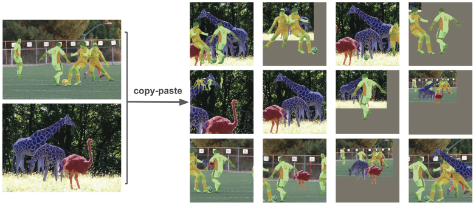

# Data Augmentation
## Random affine

## Mosaic

## Copy-Paste
[Simple Copy-Paste is a Strong Data Augmentation Method for Instance Segmentation](https://arxiv.org/abs/2012.07177)

## mixup
[mixup: Beyond Empirical Risk Minimization](https://arxiv.org/abs/1710.09412)

$$\begin{align}
\tilde{x} &= \lambda x_i + (1-\lambda) x_j, \quad \text{where }x_i,x_j\text{ are raw input vectors} \\
\tilde{y} &= \lambda y_i + (1-\lambda) y_j, \quad \text{where }y_i,y_j\text{ are one-hot label encodings}
\end{align}$$

[MixUp augmentation for image classification](https://keras.io/examples/vision/mixup/)

## HSV augmentation

## Random horizontal/vertical flip

## Tools
- [Albumentations: fast and flexible image augmentations](https://albumentations.ai/)