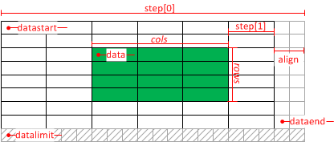

# Core Operations
[OpenCV: Core Operations](https://docs.opencv.org/4.x/d7/d16/tutorial_py_table_of_contents_core.html)
- [OpenCV: Basic Operations on Images](https://docs.opencv.org/4.x/d3/df2/tutorial_py_basic_ops.html)
- [OpenCV: Arithmetic Operations on Images](https://docs.opencv.org/4.x/d0/d86/tutorial_py_image_arithmetics.html)
- [OpenCV: Performance Measurement and Improvement Techniques](https://docs.opencv.org/4.x/dc/d71/tutorial_py_optimization.html)

## Image file reading and writing
`<opencv2/imgcodecs.hpp>`

[OpenCV: Image file reading and writing](https://docs.opencv.org/4.x/d4/da8/group__imgcodecs.html)

### 如何异步读取图像？
只能先自己异步加载，再用 `imdecode` 进行解码 [^decode-so]。

[^decode-so]: [c++ - How to use cv::imdecode, if the contents of an image file are in a char array? - Stack Overflow](https://stackoverflow.com/questions/4271489/how-to-use-cvimdecode-if-the-contents-of-an-image-file-are-in-a-char-array)

## Region of Interest
[confusion about Mat::data, datastart, dataend, datalimit, step · Issue #8304 · opencv/opencv](https://github.com/opencv/opencv/issues/8304)



[How to crop a CvMat in OpenCV? - Stack Overflow](https://stackoverflow.com/questions/8267191/how-to-crop-a-cvmat-in-opencv)
```cpp
cv::Rect myROI(10, 10, 100, 100);
cv::Mat cropped = mat(myROI);
```
- Rect: `{ x, y, width, height }`
- Python 中 ROI 可以直接赋值，但 C++ 中要用 `copyTo`