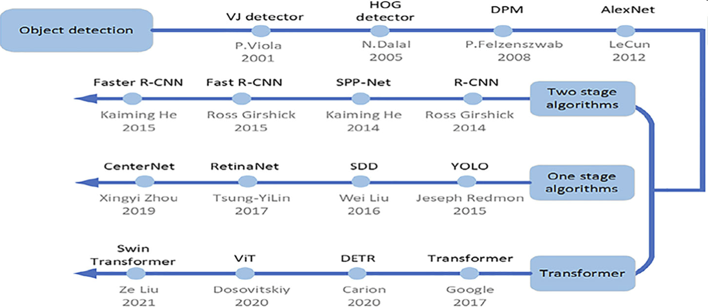

# Object Recognition
[Wikipedia](https://en.wikipedia.org/wiki/Outline_of_object_recognition), [Paper With Code](https://paperswithcode.com/task/object-detection)

**Object recognition** – technology in the field of computer vision for finding and identifying objects in an image or video sequence.

Approaches:
- Single-stage detectors
  - [You Only Look Once](YOLO/README.md)
- Object detection + Image classification

[^arkin]

## Metrics
- Mean [average precision](../Object%20Detection/README.md#Metrics) (mAP)

  The mean of average precision over all classes.

## Datasets
FPS games:
- PUBG
  
  Dataset | Images | Image size | Comment
  --- | --- | --- | ---
  [pubg](https://universe.roboflow.com/rmcplay/pubg-wvdw7) [pubgv-2](https://universe.roboflow.com/chibaohezu-se2fb/pubgv-2) | 3790 | 416x416
  [People Finder](https://universe.roboflow.com/shenmoren-h0xvi/people-finder-pfayq) | 3019 | 640x640
  [Player Models](https://universe.roboflow.com/pubg-g9vmu/player-models-k8fa0) | 2744 | 640x640 | YOLOv8n $mAP_{50}=96.5,\ mAP_{50-95}=67.2$ YOLOv8s $mAP_{50}=97.0,\ mAP_{50-95}=68.9$
  [pubg2](https://universe.roboflow.com/dbuo-rt-epddl/pubg2) | 1719 | 640x640
  [Pubg](https://universe.roboflow.com/ryan-nguyen/pubg-kfa6v) [xxxtest](https://universe.roboflow.com/yolo-hsg3o/xxxtest/) | 1509 | 2560x1440
  [enemy detect](https://universe.roboflow.com/project-11zx3/enemy-detect) | 1238 | 1920x1920
  [PUBG](https://universe.roboflow.com/luizconrado/pubg-rhc8l/health) | 849 | 3840x2160
  [pubg](https://universe.roboflow.com/2799283008-qq-com/pubg-jaw28) | 500 | 2560x1440
  [pubg](https://universe.roboflow.com/fghjdftg/pubg-hj1ow) | 240 | 416x416
  [Yolov5-pubg](https://universe.roboflow.com/aaaa-yx8lt/yolov5-pubg) | 134 | 1920x1080
- 和平精英

  Dataset | Images | Image size
  --- | --- | ---
  [Peace](https://universe.roboflow.com/new-workspace-4kvpa/peace-prmz9) | 739 | 1920x1440

[^arkin]: Arkin, Ershat, Nurbiya Yadikar, Xuebin Xu, Alimjan Aysa, and Kurban Ubul. “A Survey: Object Detection Methods from CNN to Transformer.” Multimedia Tools and Applications 82, no. 14 (October 21, 2022): 21353–83. https://doi.org/10.1007/s11042-022-13801-3.