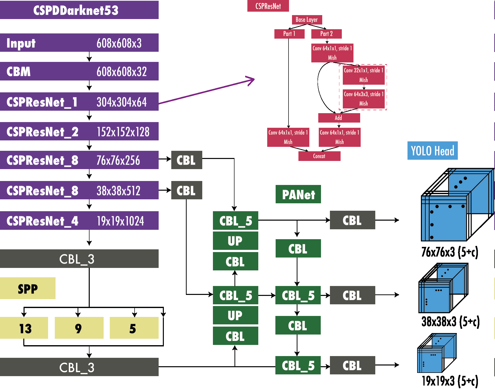

# You Only Look Once
- 2015-06 [YOLO](https://arxiv.org/abs/1506.02640)
  - [Darknet](https://github.com/pjreddie/darknet)
- 2016-12 [YOLOv2](https://arxiv.org/abs/1612.08242)
  - YOLO9000
- 2018-04 [YOLOv3](https://arxiv.org/abs/1804.02767)
  - YOLOv3-spp
  - [ultralytics/yolov3: YOLOv3 in PyTorch > ONNX > CoreML > TFLite](https://github.com/ultralytics/yolov3)
- 2020-04 [YOLOv4](https://github.com/Tianxiaomo/pytorch-YOLOv4) ([Paper](https://arxiv.org/abs/2004.10934))
- 2020-06 [YOLOv5](https://github.com/ultralytics/yolov5)
- 2020-07 [PP-YOLO](https://arxiv.org/abs/2007.12099)
- 2021-04 [PP-YOLOv2](https://arxiv.org/abs/2104.10419)
- 2021-05 [YOLOR](https://github.com/WongKinYiu/yolor) ([Paper](https://arxiv.org/abs/2105.04206))
- 2021-07 [YOLOX](https://github.com/Megvii-BaseDetection/YOLOX) ([Paper](https://arxiv.org/abs/2107.08430))
- 2022-03 [PP-YOLOE](https://arxiv.org/abs/2203.16250)
- 2022-06 [YOLOv6](https://github.com/meituan/YOLOv6)
  - 2022-09 YOLOv6 2.0
  - 2023-01 YOLOv6 3.0

    [Is YOLOv6 v3.0 better than YOLOv8? | by Ritesh Kanjee | Medium](https://augmentedstartups.medium.com/is-yolov6-v3-0-better-than-yolov8-4bb2a9a18805)
  - 2023-04 YOLOv6 4.0
- 2022-07 [YOLOv7](https://github.com/WongKinYiu/yolov7)
- 2022-11 [DAMO-YOLO](https://github.com/tinyvision/DAMO-YOLO) ([Paper](https://arxiv.org/abs/2211.15444))
- 2023-01 [YOLOv8](https://github.com/ultralytics/ultralytics)

  [What is YOLOv8? The Ultimate Guide.](https://blog.roboflow.com/whats-new-in-yolov8/)
- 2023-05 [YOLO-NAS](https://github.com/Deci-AI/super-gradients/blob/master/YOLONAS.md)

  [Is YOLO-NAS better than YOLOv8? · Issue #2468 · ultralytics/ultralytics](https://github.com/ultralytics/ultralytics/issues/2468)

Review:
- [The YOLO Algorithm: A Guide to YOLO Models](https://blog.roboflow.com/guide-to-yolo-models/)
- 2023-04 [A Comprehensive Review of YOLO: From YOLOv1 and Beyond](https://arxiv.org/abs/2304.00501)

## [YOLO](https://arxiv.org/abs/1506.02640)
[^terven]

## [YOLOv2](https://arxiv.org/abs/1612.08242)
- Batch normalization
- Fully convolutional
- Use anchor boxes to predict bounding boxes

  [^terven]
- Multi-scale training

## [YOLOv3](https://arxiv.org/abs/1804.02767)
[python - YOLOV8 how does it handle different image sizes - Stack Overflow](https://stackoverflow.com/questions/75268393/yolov8-how-does-it-handle-different-image-sizes)

## [YOLOv4](https://arxiv.org/abs/2004.10934)
[^terven]

## [YOLOv5](https://github.com/ultralytics/yolov5)
[^terven]

Data augmentations:
- Mosaic
- Copy paste
- Random affine
- MixUp
- HSV augmentation
- Random horizontal flip
- Albumentations

## [YOLOX](https://arxiv.org/abs/2107.08430)
- Anchor-free
- Decoupled head

## [YOLOv6](https://github.com/meituan/YOLOv6)

## [YOLOv8](https://github.com/ultralytics/ultralytics)
[What is YOLOv8? The Ultimate Guide.](https://blog.roboflow.com/whats-new-in-yolov8/)

Training:
- YOLOv8n, imgsz=640, batch=28 大约需要 6G 内存。
- YOLOv8s, imgsz=640, btach=13 大约需要 5G 内存。
- YOLOv8x, imgsz=640, batch=16 大约需要 17G 内存。

Data augmentations:
- Mosaic
- Copy paste
- Random affine
- MixUp
- HSV augmentation
- Random horizontal/vertical flip
- Albumentations

[Using data augmentation on YOLOv8 · Issue #2412 · ultralytics/ultralytics](https://github.com/ultralytics/ultralytics/issues/2412)

初次下载 datasets 时的目录会被自动设置为 `datasets_dir`，可以通过 `yolo settings` 查看。

[^terven]: Terven, Juan, and Diana Cordova-Esparza. “A Comprehensive Review of YOLO: From YOLOv1 and Beyond.” arXiv, May 19, 2023. https://doi.org/10.48550/arXiv.2304.00501.